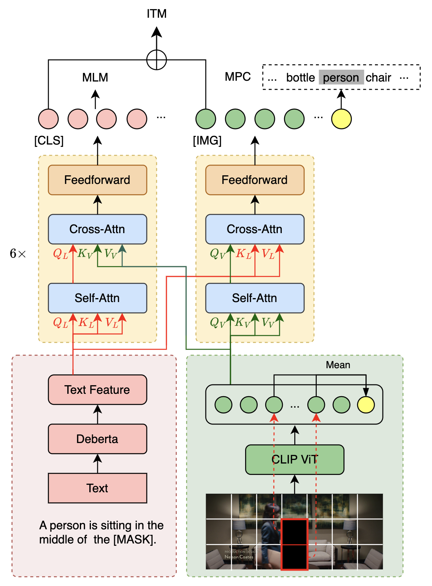
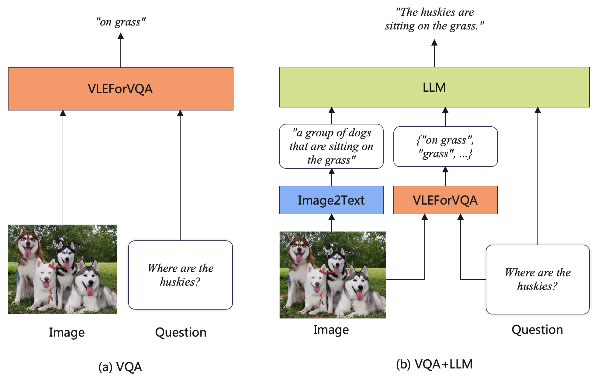
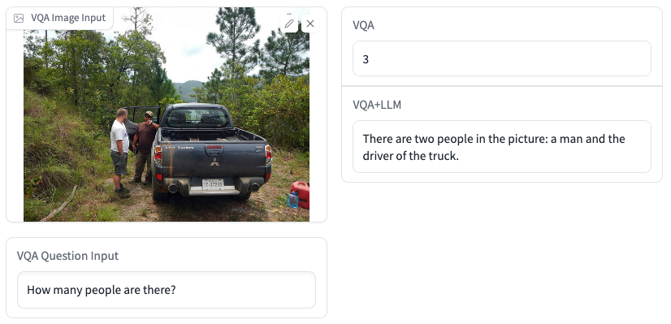
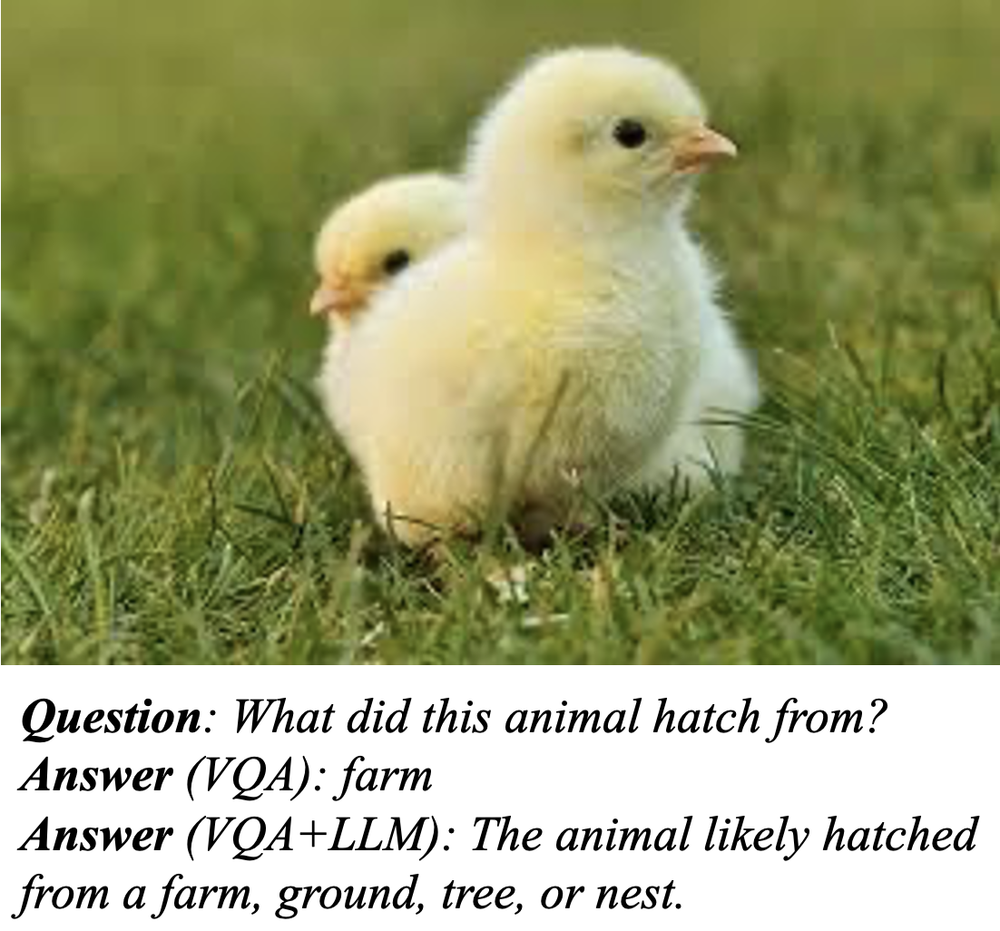

[**中文**](README_ZH.md) | [**English**](README.md)

<p align="center">
    <br>
    
    <br>
</p>
<p align="center">
    <a href="https://github.com/iflytek/VLE/blob/main/LICENSE">
        
    </a>
</p>

# VLE: Vision-Language Encoder (VLE：视觉-语言多模态预训练模型)

Multimodal pre-trained models are trained on massive multimodal data, and they can utilize information from different modalities and perform various cross-modal tasks. 

In this repository, we introduce **VLE** (**V**isual-**L**anguage **E**ncoder), an image-text multimodal understanding model built on the pre-trained text and image encoders. It can be used for multimodal discriminative tasks such as visual question answering and image-text retrieval. Especially on the visual commonsense reasoning (VCR) task, which requires high-level language understanding and reasoning skills, VLE achieves the best performance among the public methods.

Recently, LLMs (Large Language Models) have achieved great success and have been used for a wide range of text tasks, including translation, question answering, text summarization, etc. While LLMs are unimodal, their abilities can be leveraged for multimodal understanding tasks. We propose a VQA+LLM pipeline that integrates multimodal models with LLMs for the visual question answering task. It helps the VQA model generate more accurate and fluent answers. 

We open-source VLE-related resources for promoting academic research.

Online VLE demo on Visual Question Answering: [https://huggingface.co/spaces/hfl/VQA_VLE_LLM](https://huggingface.co/spaces/hfl/VQA_VLE_LLM)

----

[Chinese LERT](https://github.com/ymcui/LERT) | [Chinese and English PERT](https://github.com/ymcui/PERT) | [Chinese MacBERT](https://github.com/ymcui/MacBERT) | [ChineseMiniRBT](https://github.com/iflytek/MiniRBT) | [Chinese ELECTRA](https://github.com/ymcui/Chinese-ELECTRA) | [Chinese XLNet](https://github.com/ymcui/Chinese-XLNet) | [Chinese BERT](https://github.com/ymcui/Chinese-BERT-wwm) | [ Knowledge distillation tool TextBrewer](https://github.com/airaria/TextBrewer) | [Model pruning tool TextPruner](https://github.com/airaria/TextPruner)

More resources released by HFL: https://github.com/ymcui/HFL-Anthology

## Table of Contents

| Section                       | Description                                                 |
| ----------------------------- | ----------------------------------------------------------- |
| [Introduction](#introduction) | Introduction to VLE                                         |
| [Downloads](#downloads)       | Download links for VLE                                      |
| [Comparison](#comparison)     | Comparison of VLE with other models                         |
| [VLE with LLM](#vle_with_llm) | Generating accurate and fluent VQA answers with VLE and LLM |
| [Usage](#usage)               | How to load VLE for different tasks                         |

## Introduction

### Structure

The structure of VLE is similar to [METER](https://arxiv.org/abs/2111.02387), which consists of two unimodal encoders for text and image separately, followed by a crossmodal fusion module. However, there are several structural differences between VLE and METER:

* VLE uses DeBERTa-v3 as the text encoder, which is stronger than RoBERTa-base used in METER.
* In the large version of VLE (VLE-large), the hidden size of the crossmodal co-attention fusion module is scaled up to 1024 to increase capacities.
* During fine-tuning, VLE introduces additional token_type_embeddings.

### Pre-training

VLE is pre-trained with image-caption pairs. There are four objectives applied during the pre-training stage:
* **MLM** (Masked Language Modeling): Given an image-caption pair, we randomly mask some input text tokens, and the model is trained to reconstruct the original tokens.
* **ITM** (Image-Text Matching): Given a batch of matched or mismatched image-caption pairs, the model needs to identify which images and captions correspond to each other.
* **MPC** (Masked Patch-box Classification): Given an image-caption pair with some patches masked, the model needs to predict the classes of the objects in the masked patches.
* **PBC** (Patch-box classification): Given an image-caption pair, the models need to identify which patches are related to the caption.

VLE models are pre-trained on 14M public English image-caption pairs for 25k steps with a batch size of 2048.

The following figure illustrates the VLE structure and the pre-training objectives (for simplicity, we omit the PBC objective in the figure).


<div align=center></div>

### Adaptation for downstream tasks

#### Visual Question Answering (VQA)

* We follow the standard practice to train the models on VQA with both training and validation data, and test the models on the test-dev set. The pooler output from the last layer of the fusion module is used for classification.

#### Visual Commonsense Reasoning (VCR)

* We format VCR as a multiple-choice task which is similar to RACE. For each object in the image in each example, we append the average of patches that cover the object to the image feature embeddings before the fusion module. We also assign token_type_ids to the objects in the image and text to improve alignment between different modalities.


## Downloads

The model weights are in PyTorch format and can be downloaded through the 🤗 transformers model hub.

You can either download the weights and configurations manually or initialize a VLE model with `from_pretrained(model_name)`  method in your code.

### Pre-trained Checkpoints

| Model     | Text Encoder     | Image Encoder          | # Params<sup>*</sup> | MODEL_NAME    | Link                                         |
| --------- | ---------------- | ---------------------- | -------------------- | ------------- | -------------------------------------------- |
| VLE-base  | DeBERTa-v3-base  | CLIP-ViT-base-patch16  | 378M                 | hfl/vle-base  | [link](https://huggingface.co/hfl/vle-base)  |
| VLE-large | DeBERTa-v3-large | CLIP-ViT-large-patch14 | 930M                 | hfl/vle-large | [link](https://huggingface.co/hfl/vle-large) |

<sup>*</sup> : We exclude task heads when counting the number of parameters.

### Fine-tuned Checkpoints

| Model                  | Text Encoder     | Image Encoder          | MODEL_NAME                 | Link                                                      |
| ---------------------- | ---------------- | ---------------------- | -------------------------- | --------------------------------------------------------- |
| VLE-base-for-VQA       | DeBERTa-v3-base  | CLIP-ViT-base-patch16  | hfl/vle-base-for-vqa       | [link](https://huggingface.co/hfl/vle-base-for-vqa)       |
| VLE-large-for-VQA      | DeBERTa-v3-large | CLIP-ViT-large-patch14 | hfl/vle-large-for-vqa      | [link](https://huggingface.co/hfl/vle-large-for-vqa)      |
| VLE-base-for-VCR-q2a   | DeBERTa-v3-base  | CLIP-ViT-base-patch16  | hfl/vle-base-for-vcr-q2a   | [link](https://huggingface.co/hfl/vle-base-for-vcr-q2a)   |
| VLE-large-for-VCR-q2a  | DeBERTa-v3-large | CLIP-ViT-large-patch14 | hfl/vle-large-for-vcr-q2a  | [link](https://huggingface.co/hfl/vle-large-for-vcr-q2a)  |
| VLE-base-for-VCR-qa2r  | DeBERTa-v3-base  | CLIP-ViT-base-patch16  | hfl/vle-base-for-vcr-qa2r  | [link](https://huggingface.co/hfl/vle-base-for-vcr-qa2r)  |
| VLE-large-for-VCR-qa2r | DeBERTa-v3-large | CLIP-ViT-large-patch14 | hfl/vle-large-for-vcr-qa2r | [link](https://huggingface.co/hfl/vle-large-for-vcr-qa2r) |

## Comparison

In the following table, we compare the performance of VLE with METER and other multimodal models. The VQA results are on the test-dev set, and the VCR results are on the dev set.

| Model               | VQA | VCR (QA2R) | VCR (Q2A) | # Params | # pre-training data<sup>*</sup> |
| ------------------- | ---------------- | -------------- | ------------- | ------------ | ------- |
| CoCa | 82.3 | - | - | 2.1 B | unknown |
| BeiT-3 | 84.2 | - | - | 1.9 B | 21M Pairs + 14M(I) + 160G(T) |
| OFA | 82.0 | - | - | 930M | 15M Pairs + 39M(I) + 140G(T) |
| BLIP | 78.3 | - | - | 385M | 129M Pairs |
| METER-CLIP-ViT-base | 77.7  (76.8<sup>†‡</sup>) | 79.8<sup>§</sup> | 77.6<sup>§</sup> | 345M         | 4M Pairs |
| METER-CoSwin-Huge   | 80.3           | -              | -             | 878M         | 14M Pairs |
| VLE-base            | 77.6<sup>‡</sup> | 83.7<sup>§</sup> | 79.9<sup>§</sup> | 378M         | 14M Pairs |
| VLE-large           | 79.3<sup>‡</sup> | 87.5<sup>§</sup> | 84.3<sup>§</sup> | 930M | 14M Pairs |

<sup>†</sup> : Result from our reimplementation.

<sup>‡</sup> : Fine-tuning hyperparameters: lr=7e-6, batch_size={256, 512}, num_epochs=10

<sup>§</sup> : Fine-tuning hyperparameters: lr=1e-5, batch_size=128, num_epochs=5

<sup>*</sup> : Pairs: Image-caption pairs. I : Images. T: Text.

From the above results, we see that:

**VLE is pre-training efficient**. Compared to models with similar model sizes, VLE achieves comparable or even better performance on VQA with much less pre-training data. 

**VLE shows higher reasoning ability**. Especially it significantly outperforms METER on Visual Commonsense Reasoning (VCR), which requires higher level language and reasoning skills than VQA. 

## VLE with LLM

### Generating Accurate and Fluent VQA Answers

LLMs have achieved great success on a wide range of text tasks, while the abilities of LLMs can also be leveraged for multimodal understanding tasks. Specifically, we present a VQA+LLM pipeline that integrates multimodal models with LLMs for the visual question answering task, which helps the VQA model to generate more accurate and fluent answers. 

The workflows are shown in the figure below. 

<div align=center></div>

(a) VQA: This is the standard way to perform the VQA task with a discriminative model. The question and the image are fed into the multimodal model, and the model is trained to predict the correct answer labels.

(b) VQA + LLM: The captioning model generates a caption of the image. The caption, question, and answer candidates predicted by the VQA model are concatenated and fed to the LLM. The LLM is asked to give the most reasonable answer.

We find that VQA+LLM can not only make more accurate predictions, but also generate more fluent and readable predictions. We list some examples:

**VLE+LLM improves the accuracy**

<div align=center></div>

**VLE+LLM makes the answer more reasonable**

<div align=center></div>

The demo is available at : https://huggingface.co/spaces/hfl/VQA_VLE_LLM


## Usage

**Requirements**

*  PIL
* Transformers >= 4.25
* PyTorch Lightning (only required for running fine-tuning scripts)

The model classes are defined in the *.py files in [models/VLE](models/VLE). To import VLE into your code, just copy [models](models) directory into your project.

To run the following demo code, git clone the repository and cd into it, ensuring you are in the repository's root directory.

### Initializing a VLEModel

```python
from models.VLE import VLEModel, VLEProcessor
from PIL import Image
import torch

model_name="hfl/vle-large"
images = [Image.open('pics/dogs.png')]
text = ["There are dogs on the grass."]

model = VLEModel.from_pretrained(model_name)
vle_processor = VLEProcessor.from_pretrained(model_name)
multimodal_inputs = vle_processor(text=text,images=images, return_tensors='pt',padding=True)

#forward
vle_output = model(**multimodal_inputs)
```

### Inference

#### Visual Question Answering (VQA)

```python
from models.VLE import VLEForVQA, VLEProcessor, VLEForVQAPipeline
from PIL import Image

model_name="hfl/vle-base-for-vqa"
text= "What is the color of the floor?"
image = Image.open("pics/door.png")

model = VLEForVQA.from_pretrained(model_name)
vle_processor = VLEProcessor.from_pretrained(model_name)
vqa_pipeline = VLEForVQAPipeline(model=model, device='cpu', vle_processor=vle_processor)

vqa_answers = vqa_pipeline(image=image, question=text, top_k=5)
print(f"Question: {text}. Answers: {vqa_answers}")
```

#### Image-Text Matching

```python
from models.VLE import VLEForITM, VLEProcessor, VLEForITMPipeline
from PIL import Image

model_dir = 'hfl/vle-base'
itm_text = ["a photo of a cat.", "a photo of dogs."]
itm_images = Image.open("pics/dogs.png")

print("Init ITM model")
model = VLEForITM.from_pretrained(model_dir)
vle_processor = VLEProcessor.from_pretrained(model_dir)

print("init ITM pipeline")
itm_pipeline = VLEForITMPipeline(model=model, device='cpu', vle_processor=vle_processor)
itm_pred = itm_pipeline([{"image": itm_images, "text": itm_text[0]}, 
                         {"image": itm_images, "text": itm_text[1]}])

for t, pred in zip(itm_text,itm_pred):
    print(t,pred)
```

#### Patch Box Classification

```python
from models.VLE import VLEForPBC, VLEProcessor, VLEForPBCPipeline
from PIL import Image

model_dir = 'hfl/vle-base'
pbc_text = "pink tongues"
pbc_image = Image.open("pics/dogs.png")

print("Init PBC model")
model = VLEForPBC.from_pretrained(model_dir)
vle_processor = VLEProcessor.from_pretrained(model_dir)

print("init PBC pipeline")
pbc_pipeline = VLEForPBCPipeline(model=model, device='cpu', vle_processor=vle_processor)
pbc_pred = pbc_pipeline(image=pbc_image,text=pbc_text)
print(pbc_text)
pbc_pred['image'].save('pics/pink_tongues.png')
```


#### Visual Commonsense Reasoning (VCR)

Please follow the instructions in [examples/VCR/README.md](examples/VCR/README.md)

### Fine-tuning

#### Fine-tuning on VQA

Please follow the instructions in [examples/VQA/README.md](examples/VQA/README.md)

## Follow us

Welcome to follow the official WeChat account of HFL to keep up with the latest technical developments.


## Issues
If you have questions, please submit them in a GitHub Issue.

- Before submitting an issue, please check whether the FAQ can solve the problem, and it is recommended to check whether the previous issue can solve your problem.
- Duplicate and unrelated issues will be handled by [stable-bot](stale · GitHub Marketplace).
- We will try our best to answer your questions, but there is no guarantee that your questions will be answered.
- Politely ask questions and build a harmonious discussion community.
