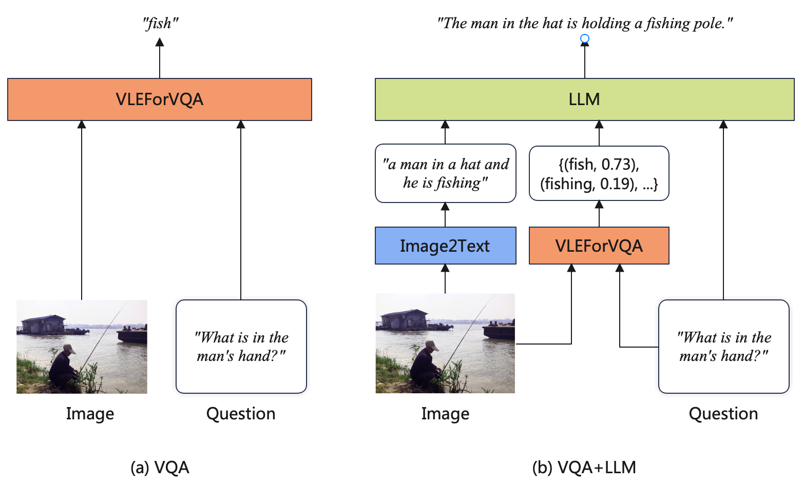

[**中文**](README_ZH.md) | [**English**](README.md)

<p align="center">
    <br>
    
    <br>
</p>
<p align="center">
    <a href="https://github.com/iflytek/VLE/blob/main/LICENSE">
        
    </a>
</p>

# VLE：视觉-语言多模态预训练模型

多模态预训练模型通过在多种模态的大规模数据上的预训练，可以综合利用来自不同模态的信息，执行各种跨模态任务。在本项目中，我们推出了**VLE** (**V**isual-**L**anguage **E**ncoder)，一种基于预训练文本和图像编码器的图像-文本多模态理解模型，可应用于如视觉问答、图像-文本检索等多模态判别任务。特别地，在对语言理解和推理能力有更强要求的视觉常识推理（VCR）任务中，VLE取得了公开模型中的最佳效果。

最近，大型语言模型（LLM）取得了巨大成功，并被用于翻译、问答、摘要等文本任务。虽然LLM是单模态模型，但它们的能力也可用于辅助多模态理解任务。借助LLM的zero-shot能力，我们设计了一种VQA+LLM方案，将大型语言模型集成到视觉问答任务中，实现了帮助视觉问答模型生成更准确和流畅的答案。

我们开源VLE相关资源，以供学术研究参考。

在线演示地址：https://huggingface.co/spaces/hfl/VQA_VLE_LLM

----

[中文LERT](https://github.com/ymcui/LERT) | [中英文PERT](https://github.com/ymcui/PERT) | [中文MacBERT](https://github.com/ymcui/MacBERT) | [中文MiniRBT](https://github.com/iflytek/MiniRBT) | [中文ELECTRA](https://github.com/ymcui/Chinese-ELECTRA) | [中文XLNet](https://github.com/ymcui/Chinese-XLNet) | [中文BERT](https://github.com/ymcui/Chinese-BERT-wwm) | [知识蒸馏工具TextBrewer](https://github.com/airaria/TextBrewer) | [模型裁剪工具TextPruner](https://github.com/airaria/TextPruner)

查看更多哈工大讯飞联合实验室（HFL）发布的资源：https://github.com/iflytek/HFL-Anthology

## 内容导引

| 章节 | 描述                                                 |
| ----------------------------- | ----------------------------------------------------------- |
| [简介](#简介) | VLE的结构和训练技术                            |
| [模型下载](#模型下载) | VLE预训练模型下载地址                       |
| [模型对比](#模型对比) | 多模态任务上VLE与其他模型的比较 |
| [结合大模型的视觉问答](#结合大模型的视觉问答) | 结合大模型的视觉问答策略 |
| [模型使用](#模型使用)       | 模型的加载与使用方法             |

## 简介

### 模型结构

VLE模型采用双流-单流结构，与METER模型结构类似，由两个单模态编码器（图像编码器和文本编码器）和一个跨模态融合模块构成。VLE与METER的结构上的差异在于：

* VLE使用DeBERTa-v3作为文本编码器，其性能优于METER中使用的RoBERTa-base。
* 在VLE-large中，跨模态融合模块的隐层维度增加至1024，以增加模型的容量。
* 在精调阶段，VLE引入了额外的token类型向量表示。

### 预训练

VLE使用图文对数据进行预训练。在预训练阶段，VLE采用了四个预训练任务：

* **MLM** (Masked Language Modeling)：掩码预测任务。给定图文对，随机遮掩文本中的部分单词，训练模型还原遮掩的文本。
* **ITM** (Image-Text Matching)：图文匹配预测任务。给定图文对，训练模型判断图像和文本是否匹配。
* **MPC** (Masked Patch-box Classification)：遮掩Patch分类任务，给定图文对，并遮掩掉图片中包含具体对象的patch，训练模型预测被遮掩的对象种类。
* **PBC** (Patch-box classification)：Patch分类任务。给定图文对，预测图片中的哪些patch与文本描述相关。

VLE在14M的英文图文对数据上进行了25000步的预训练，batch大小为2048。下图展示了VLE的模型结构和部分预训练任务（MLM、ITM和MPC）。


<div align=center></div>

### 下游任务适配

#### 视觉问答 (VQA)

* 我们遵循标准做法，使用VQA的训练集（training set）和验证集（validation set）训练模型，在test-dev集上进行验证。我们采用模型的融合层的pooler的输出进行分类任务的训练。

#### 视觉常识推理 (VCR)

* 我们将VCR格式化为一个类似于RACE的选择题任务，并对于每张图像中的对象，将覆盖该对象的patch的表示的平均池化值添加到融合模块之前的图像特征序列中。我们还为图像和文本中的对象添加额外的token_type_ids，以注入不同模态之间的对齐信息，提升模型的对齐性能。


## 模型下载

本次发布了VLE-base和VLE-large两个版本的预训练模型，模型权重为PyTorch格式，可以选择手动从🤗 transformers模型库下载权重和配置文件，或者在代码中使用 `from_pretrained(model_name)` 以自动加载模型。详细方法参加[模型使用](#模型使用)。

### 预训练权重

| 模型      | 文本编码器       | 图像编码器             | 参数量<sup>*</sup> | MODEL_NAME    | 链接                                         |
| --------- | ---------------- | ---------------------- | ------------------ | ------------- | -------------------------------------------- |
| VLE-base  | DeBERTa-v3-base  | CLIP-ViT-base-patch16  | 378M               | hfl/vle-base  | [link](https://huggingface.co/hfl/vle-base)  |
| VLE-large | DeBERTa-v3-large | CLIP-ViT-large-patch14 | 930M               | hfl/vle-large | [link](https://huggingface.co/hfl/vle-large) |

<sup>*</sup> : 仅计算encoder和emebddings的参数。特定任务的预测层的参数量未计入。

### 精调权重

| 模型                   | 文本编码器       | 图像编码器             | MODEL_NAME                 | 链接                                                      |
| ---------------------- | ---------------- | ---------------------- | -------------------------- | --------------------------------------------------------- |
| VLE-base-for-VQA       | DeBERTa-v3-base  | CLIP-ViT-base-patch16  | hfl/vle-base-for-vqa       | [link](https://huggingface.co/hfl/vle-base-for-vqa)       |
| VLE-large-for-VQA      | DeBERTa-v3-large | CLIP-ViT-large-patch14 | hfl/vle-large-for-vqa      | [link](https://huggingface.co/hfl/vle-large-for-vqa)      |
| VLE-base-for-VCR-q2a   | DeBERTa-v3-base  | CLIP-ViT-base-patch16  | hfl/vle-base-for-vcr-q2a   | [link](https://huggingface.co/hfl/vle-base-for-vcr-q2a)   |
| VLE-large-for-VCR-q2a  | DeBERTa-v3-large | CLIP-ViT-large-patch14 | hfl/vle-large-for-vcr-q2a  | [link](https://huggingface.co/hfl/vle-large-for-vcr-q2a)  |
| VLE-base-for-VCR-qa2r  | DeBERTa-v3-base  | CLIP-ViT-base-patch16  | hfl/vle-base-for-vcr-qa2r  | [link](https://huggingface.co/hfl/vle-base-for-vcr-qa2r)  |
| VLE-large-for-VCR-qa2r | DeBERTa-v3-large | CLIP-ViT-large-patch14 | hfl/vle-large-for-vcr-qa2r | [link](https://huggingface.co/hfl/vle-large-for-vcr-qa2r) |

## 模型对比

在下表中，我们比较了VLE、METER以及其他多模态模型的参数量、预训练数据和下游任务效果。其中VQA展示的的是test-dev集上的效果；VCR展现的是dev集上的效果。

| 模型             | VQA | VCR (QA2R) | VCR (Q2A) | 参数量 | 预训练数据量<sup>*</sup> |
| ------------------- | ---------------- | -------------- | ------------- | ------------ | ------- |
| CoCa | 82.3 | - | - | 2.1 B | 未知 |
| BeiT-3 | 84.2 | - | - | 1.9 B | 21M Pairs + 14M(I) + 160G(T) |
| OFA | 82.0 | - | - | 930M | 15M Pairs + 39M(I) + 140G(T) |
| BLIP | 78.3 | - | - | 385M | 129M Pairs |
| METER-CLIP-ViT-base | 77.7  (76.8<sup>†‡</sup>) | 79.8<sup>§</sup> | 77.6<sup>§</sup> | 345M         | 4M Pairs |
| METER-CoSwin-Huge   | 80.3           | -              | -             | 878M         | 14M Pairs |
| VLE-base            | 77.6<sup>‡</sup> | 83.7<sup>§</sup> | 79.9<sup>§</sup> | 378M         | 14M Pairs |
| VLE-large           | 79.3<sup>‡</sup> | 87.5<sup>§</sup> | 84.3<sup>§</sup> | 930M | 14M Pairs |

<sup>†</sup> : 复现效果

<sup>‡</sup> : 精调参数: lr=7e-6, batch_size={256, 512}, num_epochs=10

<sup>§</sup> : 精调参数: lr=1e-5, batch_size=128, num_epochs=5

<sup>*</sup> : Pairs: 图文对. I : 图像. T: 文本.

观察上表可以发现：

* **VLE的预训练更高效**：与大小相近的模型相比，VLE使用了更少的预训练数据，并在视觉问答上取得了相当甚至更好的效果。
* **VLE有更强的推理能力**： 特别地，在对推理能力要求更高的视觉常识推理（VCR）任务上，VLE显著地超过了具有相似结构的METER。

## 结合大模型的视觉问答

最近，随着指令微调、RLHF等技术的发展，LLM在多种文本任务中取得了巨大的成功。尽管LLM是单模态模型，但它们的能力也可用于辅助多模态理解任务。具体而言，我们提出一种VQA + LLM方案，将多模态模型与LLM集成到视觉问答任务中，从而帮助VQA模型生成更准确和流畅的答案。下图展示了系统流程。

<div align=center></div>

(a) VQA: 这是使用判别模型执行VQA任务的标准方式。输入问题和图像到多模态模型中，训练模型预测正确的答案标签。

(b) VQA + LLM: 首先利用captioning模型生成图片的描述；将图片描述、问题以及VQA模型的详细预测结果拼接，组合成合适的prompt的形式送入LLM，最后要求LLM模型回复最合理的答案。

VQA+LLM生成的答案更准确，也有更高的可读性。下面是一些例子：

<div align=center></div>


<div align=center></div>

Demo地址：https://huggingface.co/spaces/hfl/VQA_VLE_LLM


## 模型使用

**环境要求**

*  PIL
* Transformers >= 4.25
* PyTorch Lightning (仅用于运行精调脚本)

模型相关代码位于[models/VLE](models/VLE)目录下的*py文件中。因此，要使用VLE模型，仅需把[models](models)目录复制到你的项目代码目录即可。

要运行以下演示代码，请clone本仓库至本地，并进入仓库的根目录。

### 加载VLEModel

```python
from models.VLE import VLEModel, VLEProcessor
from PIL import Image
import torch

model_name="hfl/vle-large"
images = [Image.open('pics/dogs.png')]
text = ["There are dogs on the grass."]

model = VLEModel.from_pretrained(model_name)
vle_processor = VLEProcessor.from_pretrained(model_name)
multimodal_inputs = vle_processor(text=text,images=images, return_tensors='pt',padding=True)

#forward
vle_output = model(**multimodal_inputs)
```

### 推理

#### 视觉问答 (VQA)

```python
from models.VLE import VLEForVQA, VLEProcessor, VLEForVQAPipeline
from PIL import Image

model_name="hfl/vle-base-for-vqa"
text= "What is the color of the floor?"
image = Image.open("pics/door.png")

model = VLEForVQA.from_pretrained(model_name)
vle_processor = VLEProcessor.from_pretrained(model_name)
vqa_pipeline = VLEForVQAPipeline(model=model, device='cpu', vle_processor=vle_processor)

vqa_answers = vqa_pipeline(image=image, question=text, top_k=5)
print(f"Question: {text}. Answers: {vqa_answers}")
```

#### 图文匹配（ITM）

```python
from models.VLE import VLEForITM, VLEProcessor, VLEForITMPipeline
from PIL import Image

model_dir = 'hfl/vle-base'
itm_text = ["a photo of a cat.", "a photo of dogs."]
itm_images = Image.open("pics/dogs.png")

print("Init ITM model")
model = VLEForITM.from_pretrained(model_dir)
vle_processor = VLEProcessor.from_pretrained(model_dir)

print("init ITM pipeline")
itm_pipeline = VLEForITMPipeline(model=model, device='cpu', vle_processor=vle_processor)
itm_pred = itm_pipeline([{"image": itm_images, "text": itm_text[0]}, 
                         {"image": itm_images, "text": itm_text[1]}])

for t, pred in zip(itm_text,itm_pred):
    print(t,pred)
```

#### Patch分类（PBC）

```python
from models.VLE import VLEForPBC, VLEProcessor, VLEForPBCPipeline
from PIL import Image

model_dir = 'hfl/vle-base'
pbc_text = "pink tongues"
pbc_image = Image.open("pics/dogs.png")

print("Init PBC model")
model = VLEForPBC.from_pretrained(model_dir)
vle_processor = VLEProcessor.from_pretrained(model_dir)

print("init PBC pipeline")
pbc_pipeline = VLEForPBCPipeline(model=model, device='cpu', vle_processor=vle_processor)
pbc_pred = pbc_pipeline(image=pbc_image,text=pbc_text)
print(pbc_text)
pbc_pred['image'].save('pics/pink_tongues.png')
```


#### 视觉常识推理（VCR）

详细步骤参见 [examples/VCR/README.md](examples/VCR/README.md)

### 精调

#### VQA任务精调

详细步骤参见 [examples/VQA/README.md](examples/VQA/README.md)

## 关注我们
欢迎关注哈工大讯飞联合实验室官方微信公众号，了解最新的技术动态。


## 问题反馈
如有问题，请在GitHub Issue中提交。

- 在提交问题之前，请先查看FAQ能否解决问题，同时建议查阅以往的issue是否能解决你的问题。
- 重复以及与本项目无关的issue会被[stable-bot](stale · GitHub Marketplace)处理，敬请谅解。
- 我们会尽可能的解答你的问题，但无法保证你的问题一定会被解答。
- 礼貌地提出问题，构建和谐的讨论社区。